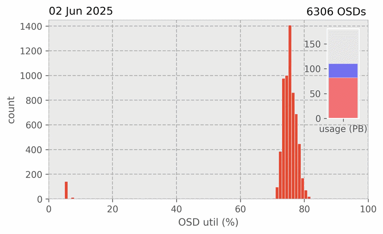

# Animate the OSD utilisation of a Ceph cluster



## Collect raw data

you can use a simple cron to start collecting the raw data:

```
# cat /etc/cron.d/ceph-osd-df.cron
*/10 * * * * root ( date --iso-8601=seconds --utc; ceph osd df -fjson > /root/df-dumps/df_$(date +'\%Y-\%m-\%d_\%H-\%M').json) >> /var/log/ceph-osd-df.log 2>&1
```
